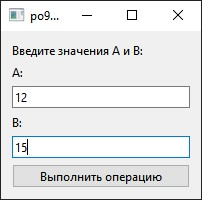
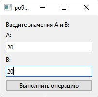
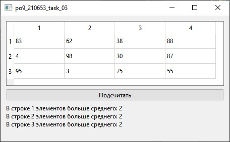
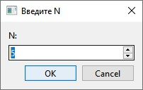
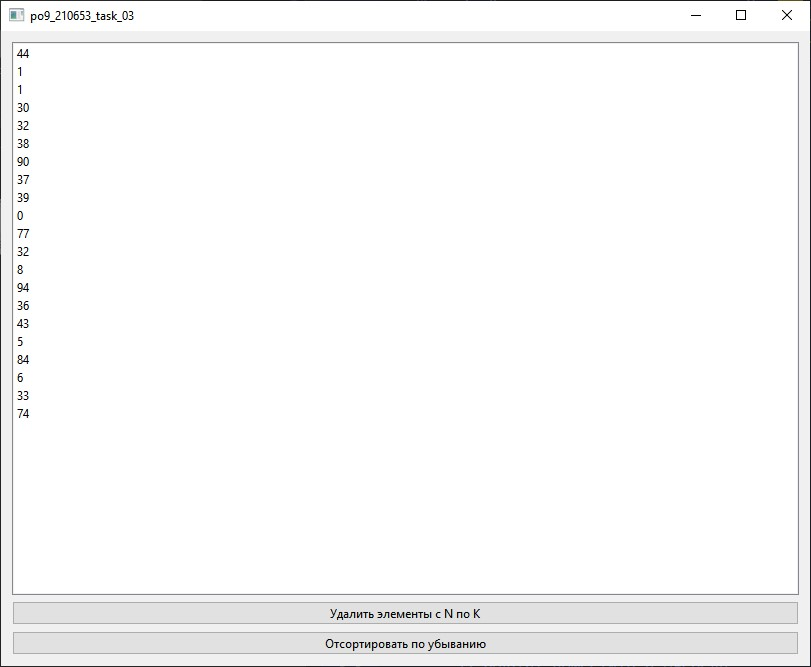
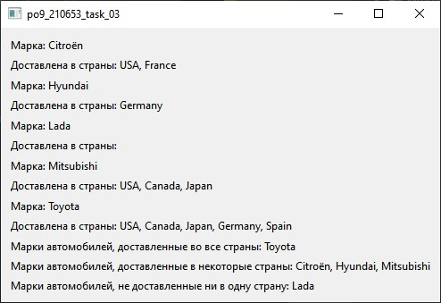
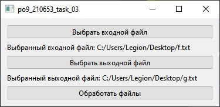

# Лабораторная работа №3
## Контейнеры в Qt5
## Вариант 4
## Цель лабораторной работы 
Отработка умений и навыков создания и использования контейнеров в Qt5

## Задание 1.
Даны две переменные целого типа: A и B (переменные вводятся в **lineedit**). Если их значения не равны, то присвоить каждой переменной сумму этих значений, а если равны, то присвоить переменным нулевые значения.

Значения не равны

Значения равны

## Задание 2.
1. Дан целочисленный массив размера N. Преобразовать его, прибавив к четным числам первый элемент. Первый и последний элементы массива не изменять.
2. Дана матрица размера m x n. В каждой строке найти количество элементов, больших среднего арифметического всех элементов этой строки.

## Задание 3.
1. Заполнить список случайными элементами и реализовать удаление элементов с позиций с N по K.
2. Заполнить связный список случайными элементами и отсортировать их по убыванию.

Список случайных элементов

Удаление с N по K

Сортировка по убыванию

## Задание 4.
1. Сформировать стек из 8 чисел. Заменить значение первого элемента стека произведением первого и последнего, значение второго элемента стека − произведением второго и предпоследнего и т.д.
2. Заполнить очередь 8 случайными числами из интервала \[-20; 50]. Найти среднее арифметическое значений двух соседних элементов очереди. Результат поместить в очередь.

## Задание 5.
Известны марки машин, изготовляемых в данной стране и импортируемых за рубеж. Даны некоторые N стран. Определить для каждой из марок, какие из них были доставлены во все страны, доставлены в некоторые из стран, не доставлены ни в одну страну.

## Задание 6
Дан файл f, компоненты которого являются целыми числами. Получите в файле g все компоненты файла f:
а) являющиеся чётными числами;
б) делящиеся на 3 и не делящиеся на 7;
в) являющиеся точными квадратами.

Исходный файл 

Результат 

